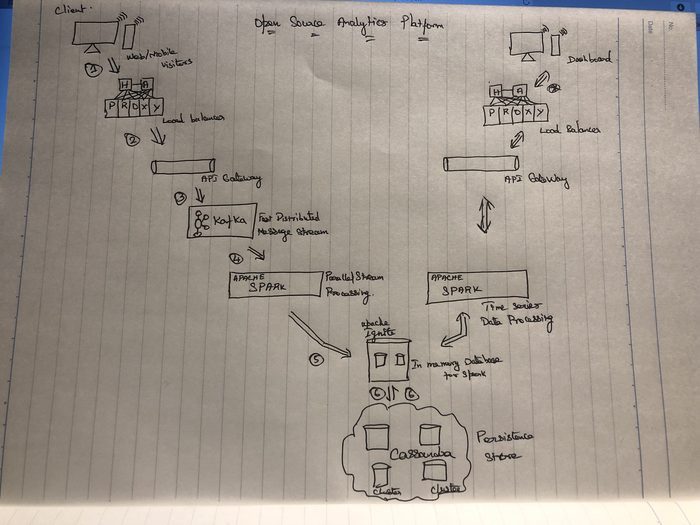

# Assignments

**Task:1**

ImmutableQueue implemented using two Immutable Stack 

**Task:2**

**High Level Design Google Analytics like Backend System**

**Client Tracking:**

Client implement require event API to collect various data about visitor.

**HA LoadBalancer:**

High availability used to distributing workloads across multiple web server.

**API:**
User Intractions are recorded and response datas to dashboard through event APIs.

**Apache Kafka Streams:**
Kafka is used for building real time streaming data pipelines that reliably 
get data between many independent systems.
Kafka Streams is a pretty fast, lightweight stream processing solution that works best if all of the data ingestion is coming through Apache Kafka. The ingested data is read directly from Kafka by Apache Spark for stream processing and creates Timeseries Ignite RDD (Resilient Distributed Datasets).

**Apache Spark:**
Spark streaming process Kafka data streams; create and share Ignite RDDs across Apache Ignite
which is a distributed memory-centric database and caching platform.

**Apache Ignite:**
Apache Ignite provides an implementation of the Spark RDD which allows any data and state to be shared in memory as RDDs across Spark jobs. The Ignite RDD provides a shared, mutable view of the same data in-memory in Ignite across different Spark jobs, workers, or applications.

**Apache Cassendra**
Apache Cassandra is an extremely powerful open source distributed database system that works extremely well to handle huge volumes of records spread across multiple commodity servers. It can be easily scaled to meet sudden increase in demand, by deploying multi-node Cassandra clusters, meets high availability requirements, and there is no single point of failure.

Ignite to work in write-behind mode: normally, a cache write involves putting data in memory, and writing the same into the persistence source, so there will be 1-to-1 mapping between cache writes and persistence writes. With the write-behind mode, Ignite instead will batch the writes and execute them regularly at the specified frequency. This is aimed at limiting the amount of communication overhead between Ignite and the persistent store, and really makes a lot of sense if the data being written rapidly changes.

**Analytics Dashboard:**
The requests will be routed from Analytics dashboard through API. Apache Spark will do processing of time series data shared in Apache Ignite as Ignite RDDs and the results will be sent across to the dashboard for visualization through reponse API.

